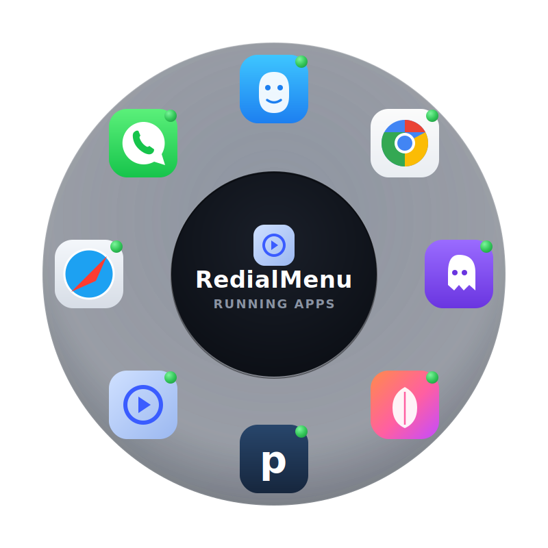
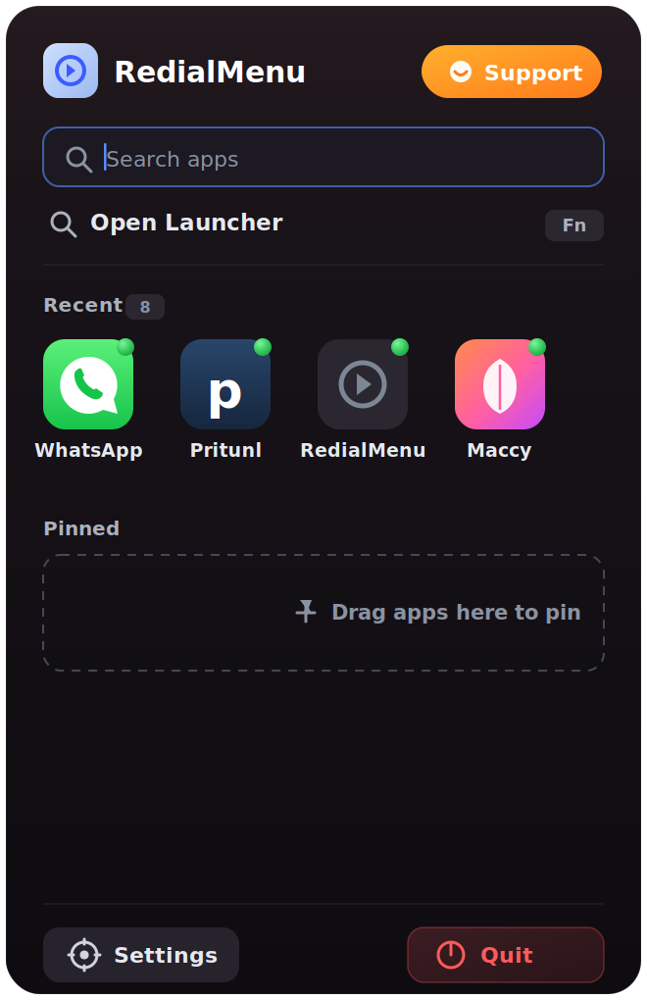

# ⟡ RedialMenu

### **A radial app launcher & switcher for macOS**

  

  
  

  
  
  

> RedialMenu lives in your menu bar. Press a hotkey and a circular wheel of your
> apps appears right under your cursor. Glide to the app you want and let go — it
> switches instantly. Think of it as a faster, more visual alternative to `⌘ + Tab`.

---

## ⬇️ Download

**[⬇️ Download RedialMenu (.dmg)](https://github.com/aniketmishra-0/RedialMenu-releases/releases/latest/download/RedialMenu.dmg)**

1. **[Click here to download `RedialMenu.dmg`](https://github.com/aniketmishra-0/RedialMenu-releases/releases/latest/download/RedialMenu.dmg)** (always the latest version).
2. Open the DMG and **drag RedialMenu into your Applications folder**.
3. Launch it from Applications — it appears as an icon in your **menu bar**.

> **First launch:** macOS may show a warning for apps downloaded from the
> internet. Just **right-click the app → Open → Open**. You only need to do this
> once; after that it opens normally.

---

## ✦ What is it?

Switching apps on macOS usually means hunting through `⌘ + Tab`, the Dock, or
Spotlight. RedialMenu puts your most important apps in a ring around your mouse
pointer so you can reach any of them with a quick flick of the wrist — no aiming
at tiny Dock icons, no cycling through a long `⌘ + Tab` list.

**The core idea in three steps:**

1. **Hold** your trigger key (the `fn` / 🌐 Globe key, or `Option + Space`).
2. **Move** the mouse toward the app you want — its slice of the wheel lights up.
3. **Release** the key (or click the icon) and RedialMenu brings that app to the front.

You can also drive it entirely from the keyboard: arrow keys / `Tab` to move
around the ring and `Return` to launch.

---

## ⚡ Features

- **Radial app wheel** — your apps arranged in a circle around the cursor.
- **Three ways to pick an app**
  - Hover and **release** the trigger key
  - **Click** an icon
  - Arrow keys / `Tab` + **`Return`**
- **Two wheel modes**
  - *Running apps* — shows everything currently open (great for switching)
  - *User-defined slots* — pin your favorite apps to fixed positions
- **Flexible trigger** — use the `fn` / 🌐 Globe key, `Option + Space`, or set your own shortcut.
- **Live running indicators** so you can see which apps are already open.
- **Optional extras** — trackpad two-finger gesture to open, gesture-draw mode, and an experimental voice command mode.
- **Glassmorphism UI** that adapts to Light and Dark mode.
- **Menu-bar only** — no Dock clutter, stays out of your way.

### 🗂️ Menu-bar dropdown

Click the menu-bar icon for a quick, polished panel with everything one tap away:

- **Instant search** — start typing to filter every installed app; press `Return` to open the top match.
- **Recent & Pinned strips** — both scroll horizontally so lots of apps fit without a tall menu. Running apps surface first.
- **Live running dots** — the same green indicator as the wheel, now shown in Recent, Pinned, and search results.
- **Window-count badges** — running apps show how many windows are open.
- **Open or quit in place** — click a tile to launch/switch to it; hover a running app to reveal a close button and quit it right there.
- **Drag to pin & reorder** — drag a Recent app onto the Pinned strip to pin it, and drag pinned tiles to reorder them.
- **Quick access** — Open Launcher up top, Settings and Quit as roomy buttons in the footer.
- **Smooth throughout** — spring-based hover, press, and transition animations.

---

## 🔐 Permissions

RedialMenu needs **Accessibility** permission to register the global hotkey
(especially the `fn` / 🌐 key) and to bring other apps to the front.

1. On first launch you'll be prompted. If you miss it, open **System Settings → Privacy & Security → Accessibility**.
2. Enable **RedialMenu** in the list.
3. Quit and relaunch the app.

**Using the `fn` / 🌐 Globe key as the trigger?** macOS reserves that key by
default. Go to **System Settings → Keyboard → "Press 🌐 key to:"** and set it to
**Do Nothing** so RedialMenu can use it. (The app shows an in-settings reminder
about this too.)

The optional voice mode also requests **Microphone** and **Speech Recognition**
permission — only when you turn it on.

---

## 🎯 Usage

| Action | How |
| --- | --- |
| Open the wheel | Hold the trigger key (`fn` or `Option + Space` by default) |
| Switch to an app | Hover its slice, then **release** the key |
| Launch by mouse | **Click** an icon |
| Keyboard navigation | Arrow keys or `Tab` to move, `Return` to launch |
| Close without switching | `Esc`, or click outside the wheel |
| Configure a pinned slot | Right-click a slot (in *user-defined* mode) |

All of these are configurable in **Settings** (open it from the menu-bar icon):
trigger shortcut, wheel size, icon size, number of slots, animations, haptics,
and more.

---

## 💻 Requirements

- macOS 15.0 (Sequoia) or later
- Apple Silicon or Intel Mac
- Accessibility permission (required for global shortcuts and app switching)

---

## 🛠️ Troubleshooting

- **The wheel doesn't open** — confirm RedialMenu is enabled in *Accessibility*, and that *Enable keyboard shortcuts* is on in Settings.
- **The `fn` key does nothing** — set *Press 🌐 key to: Do Nothing* in macOS Keyboard settings (see Permissions above).
- **Releasing the key doesn't switch apps** — make sure Accessibility permission is granted; the release detection relies on it.

---

## ☕ Support — Buy me a coffee

RedialMenu is free and made with care. If it makes your day a little smoother,
you can support its development:

**👉 [Buy me a coffee](https://razorpay.me/@aniket_mishra)**

You can also reach the same link from inside the app: click the menu-bar icon →
**Support**, or open **Settings → Buy me a coffee** to scan the QR code.
(Razorpay handles UPI, cards, and netbanking.)

Thank you for the support! 🙏

---

## 📄 License

RedialMenu is **proprietary software**. Copyright © 2026 Aniket Mishra. All Rights Reserved.

The compiled app is free to download and use, but the **source code is not open
source** and is not distributed. You may not copy, modify, reverse engineer, or
redistribute the application. See [`LICENSE`](LICENSE) for full terms.

Made with care for macOS.

